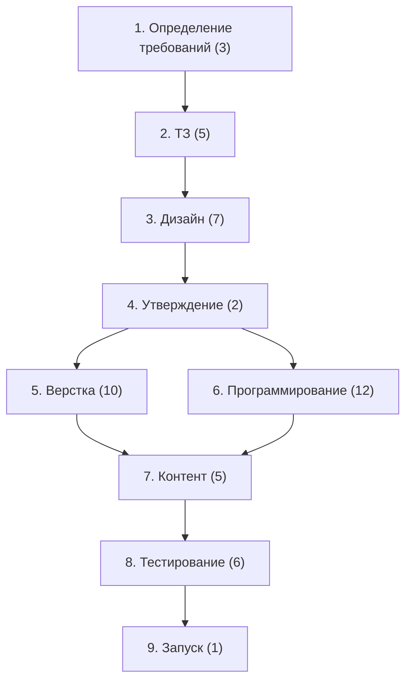

```mermaid
graph TD
    A["1. Определение требований (3)"] --> B["2. ТЗ (5)"]
    B --> C["3. Дизайн (7)"]
    C --> D["4. Утверждение (2)"]
    D --> E["5. Верстка (10)"]
    D --> F["6. Программирование (12)"]
    E --> G["7. Контент (5)"]
    F --> G
    G --> H["8. Тестирование (6)"]
    H --> I["9. Запуск (1)"]
```
